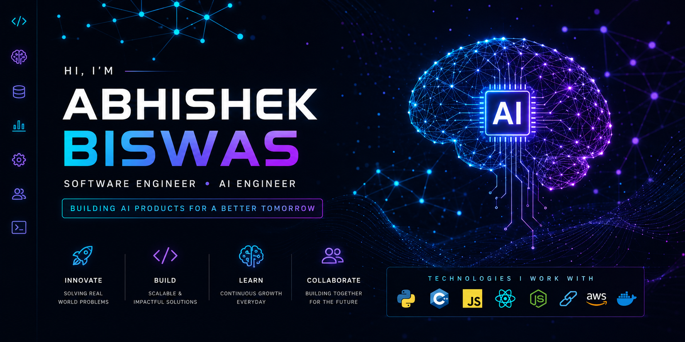
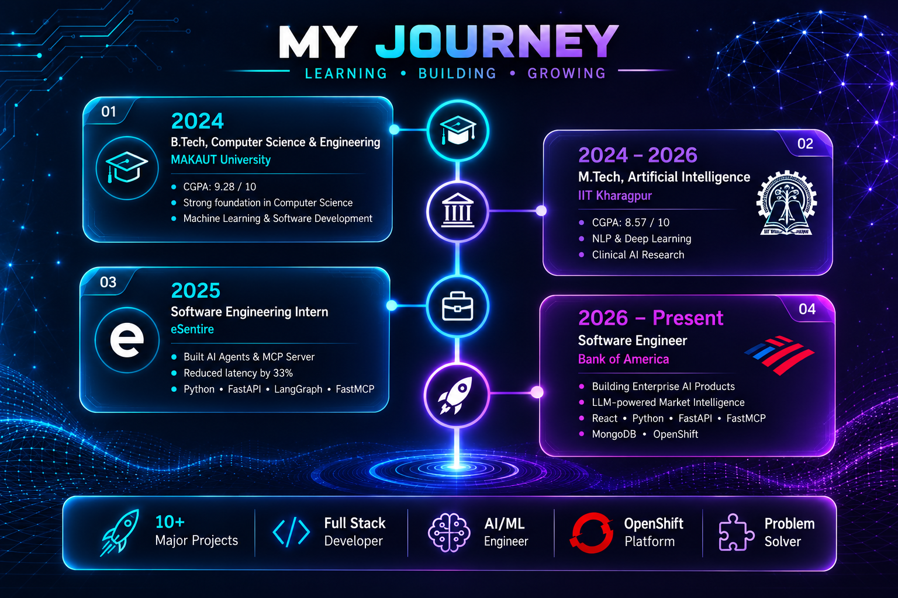
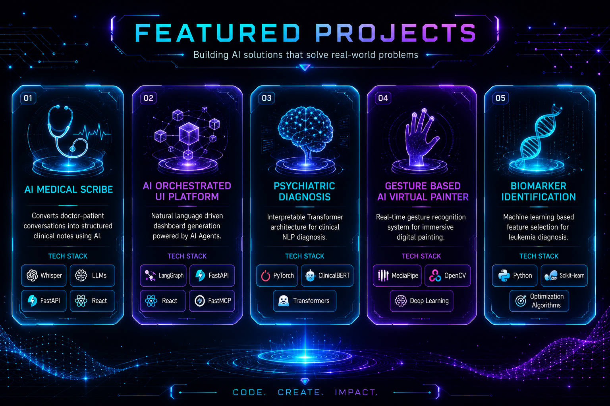
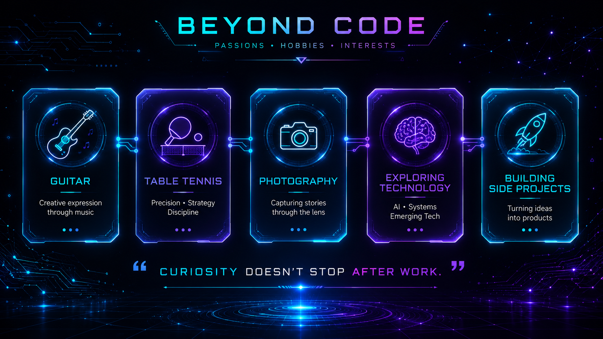
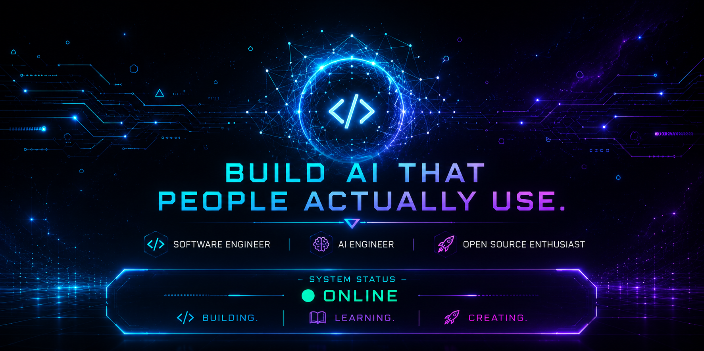

<!-- ========================================================= -->
<!--                     ABHISHEK BISWAS                       -->
<!-- ========================================================= -->

<p align="center">
  
</p>

<h1 align="center">
Hi 👋 I'm Abhishek Biswas
</h1>

<h3 align="center">
Software Engineer • AI Engineer • Building Enterprise AI Products
</h3>

<p align="center">


</p>

<p align="center">

<a href="https://github.com/YOUR_USERNAME">

</a>

<a href="https://linkedin.com/in/YOUR_LINKEDIN">

</a>

<a href="mailto:YOUR_EMAIL">

</a>

<a href="https://huggingface.co/YOUR_USERNAME">

</a>

</p>

---

# 🧠 About Me

```python
class AbhishekBiswas:

    role = "Software Engineer"

    company = "Bank of America"

    education = [
        "M.Tech Artificial Intelligence @ IIT Kharagpur",
        "B.Tech Computer Science & Engineering @ MAKAUT"
    ]

    interests = [
        "Enterprise AI",
        "LLMs",
        "AI Agents",
        "Healthcare AI",
        "Full Stack Engineering"
    ]

    stack = [
        "React",
        "Python",
        "FastAPI",
        "FastMCP",
        "MongoDB",
        "OpenShift"
    ]

    motto = "Build AI products that solve real-world problems."
```

---

# 🌌 My Journey

<p align="center">



</p>

---

# 🚀 Featured Projects

<p align="center">



</p>

---

# ⚙️ Tech Stack

### Languages

<p align="center">


</p>

### Frontend

<p align="center">


</p>

### Backend

<p align="center">


</p>

### AI / ML

<p align="center">


</p>

### Dev Tools

<p align="center">


</p>

---

# ❤️ Beyond Code

<p align="center">



</p>

---

# 📈 GitHub Analytics

<p align="center">


</p>

<p align="center">


</p>

<p align="center">


</p>

---

# 🎯 Current Focus

- 🤖 Building Enterprise AI Products
- 🧠 Multi-Agent Systems
- 💬 LLM Powered Applications
- 🩺 Healthcare AI
- ⚛️ Full Stack Engineering

---

# 💭 Philosophy

> *"Build AI that people actually use."*

---

<p align="center">



</p>

<h3 align="center">

Thanks for visiting ❤️

</h3>
